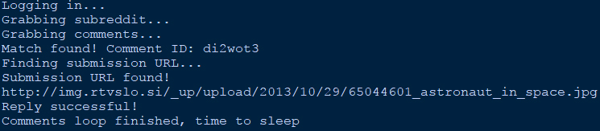

Automated Reverse Image Search
===============================

Reddit.com bot

A personal project that uses Selenium and the Reddit API to automate a reverse image search on Google. This is my first attempt at experimenting with Selenium. 

The process:

* An image is posted to Reddit.com via Imgur (current /r/test)
* A redditor can reply with "!hiresbot" to call the bot
* The code goes to work and automatically does a reverse image search on the source image
* If a larger image is found, the bot automatically replies with the URL and dimensions
* Otherwise, an error message is written inside the reply

Behind the scenes:

The output:

Direct path to the example shown:

https://www.reddit.com/r/test/comments/6diein/spacewalk/

